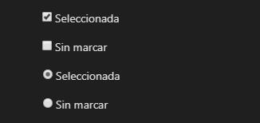
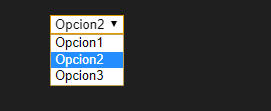
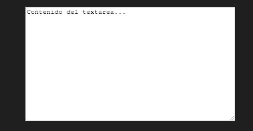
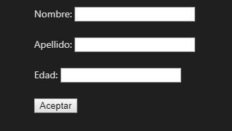
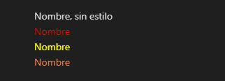

# Guia Basica para crear Paginas WEB
* [x] Estructura del documento html5
* [x] Principales etiquetas
* [x] Agregando estilos CSS al documento html
* [x] Agregando Javascript al documento html
* [ ] Envio y recibo de datos entre paginas web
* [ ] Bootstrap
* [ ] DataTables
* [ ] Graficas Highcharts
* [ ] Instalacion de Servidor Local (XAMPP)
* [ ] Conectar con Base de datos MySQL, MariaDB
* [ ] Crear Bases de Datos, Tablas
* [ ] Consultas a Tablas Querys
* [ ] Programacion PHP
* [ ] CRUD PHP MySQL Servidor Local
* [ ] SPA con Angular, React, Vue
* [ ] Reactive X RxJs
* [ ] GraphQL
* [ ] ... :smile: :+1:

# Estructura documento HTML
```html
<!DOCTYPE html>
<html>
    <head>
        <title>Titulo del documento</title>
        <!-- Estilos CSS dentro del documento -->
        <style>
            /* estilos */
            body{background-color:lightblue;}
        </style>

        <!-- Estilos CSS desde otro documento -->
        <link rel="stylesheet" type="text/css" href="estilos.css">
    </head>
    <body>

    <!-- Cuerpo del Documento -->
    Etiquetas, Inputs, Select, Tablas, Formularios, Checkbox, etc

    <!-- Carga de scripts al finalizar la carga del documento -->
    <script>
        function nombre_de_la_funcion(){
            <!-- codigo del script-->
        }
    </script>

    <!-- Carga de scripts desde otro documento -->
    <script type="text/javascript" src="scripts.js"></script>
    </body>
</html>
```

***

# Principales Etiquetas html

### Label e Input
```html
<label>Nombre:</label> 
<input type="text"  size="15"/>
```


### Checkbox y Radio
```html
<input type="checkbox" checked/>Seleccionada
<input type="checkbox" />Sin marcar

<input type="radio" checked/>Seleccionada
<input type="radio"/>Sin marcar
```


### Select
```html
<select>
    <option value="opcion 1">Opcion1
    <option value="opcion 2" selected>Opcion2
    <option value="opcion 3">Opcion3
</select>
```



### Tablas
```html
<table>
    <thead>
        <tr>
            <th>Titulo Columna 1</th>
            <th>Titulo Columna 2</th>
            <th>Titulo Columna 3</th>
        </tr>
    </thead>
    <tbody>
        <tr>
            <td>1</td>
            <td>2</td>
            <td>3</td>
        </tr>
        <tr>
            <td>4</td>
            <td>5</td>
            <td>6</td>
        </tr>
    </tbody>
</table>
```
| Titulo Columna 1 | Titulo Columna 2 | Titulo Columna 3 |
|:---:|:---:|:---:|
|1|2|3|
|4|5|6|

### Textarea
```html
<textarea cols="50" rows="10">Contenido...</textarea>
```


### Formularios
```html
<form action="url documento, script, etc" method="POST o GET">
    <label>Nombre:</label> <input type="text"/><br/><br/>
    <label>Apellido:</label> <input type="text"/><br/><br/>
    <label>Edad:</label> <input type="text"/><br/><br/>
    <input type="submit" value="Aceptar"/>
</form>
```


>**[Referencia HTML](https://www.w3schools.com/html/default.asp "Etiquetas HTML")**

***

# Estilos CSS

## Estilos dentro de la etiqueta con style="propiedad:valor;"

```html
<label >Nombre, sin estilo</label>
<label style="color:red;">Nombre</label>
<label style="color:yellow;">Nombre</label>
<label style="color:coral;">Nombre</label>
```


## Estilos desde documento CSS.

En el **HEAD** se agrega la hoja de estilos:

```html
<head>
    <link rel="stylesheet" type="text/css" href="estilos.css">
</head>
```

Dentro de **estilos.css** se agregan las etiquetas con los nombres de las clases y se aplica el estilo con su propiedad y valor:

```css
label .resaltado{
    background-color:yellow;
    color:red;
}
```

Dentro del **Body** se define en la etiqueta el nombre de la clase que se va a modificar el estilo:
```html
<body>
    <label >Nombre, sin estilo</label>
    <label class="resaltado">Nombre</label>
</body>    
```


>**[Referencia CSS](https://www.w3schools.com/css/ "Propiedades CSS")**

***

# Agregando Funciones Javascript

Funciones **JS** en el mismo documento:

>Algunos ponen los script dentro del **HEAD**.

```html
<head>    
    <script>
        // la funcion recibe el nombre
        function saludar(nombre1){ 
            // se asigna el nombre a una variable
            var nombre=nombre1;
            //se concatena y se muestra el nombre en un mensaje
            alert("hola "+ nombre);
        }
    </script>
</head>
<body>
    saludar(nombre1); <!-- Se llama a la funcion saludar y se envia el nombre-->
</body>
```

>Lo correcto es agregarlo al final del **Body** cuando se termina de cargar por completo el documento html.

```html
<head>    
    <!-- Sin scripts-->
</head>
<body>
    <!-- Inicio del body-->
    saludar(nombre1) <!-- Se llama a la funcion saludar-->


    <!-- Final del body-->

    <script>
        // la funcion recibe el nombre
        function saludar(nombre1){ 
            // se asigna el nombre a una variable
            var nombre=nombre1;
            //se concatena y se muestra el nombre en un mensaje
            alert("hola "+ nombre);
        }
    </script>
</body>
```
## Agregar scripts desde otro Documento

Algunos agregan los scripts en el **HEAD**.

```html
<head>
    <script src="scripts.js"></script>
</head>
<body>
    saludar(nombre1)
</body>
```

Lo correcto es agregarlos al final del **BODY**.

```html
<head>
    <!-- Sin scripts -->
</head>
<body>
    saludar(nombre1)
    <script src="scripts.js"></script>
</body>
```

El archivo **scripts.js** contiene la funcion:

```javascript
    // la funcion recibe el nombre
    function saludar(nombre1){ 
       // se asigna el nombre a una variable
       var nombre=nombre1;
       //se concatena y se muestra el nombre en un mensaje
       alert("hola "+ nombre);
    }
```

>**[Referencia Javascript](https://www.w3schools.com/js/ "Javascript")**

***